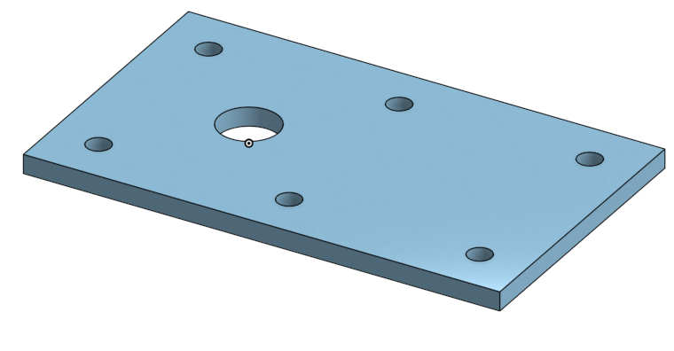
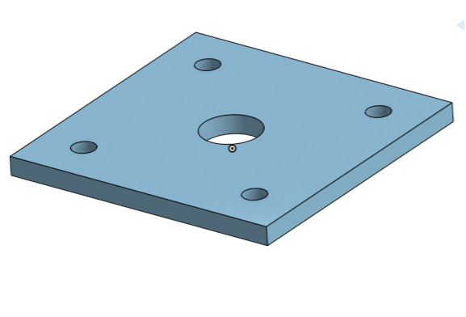
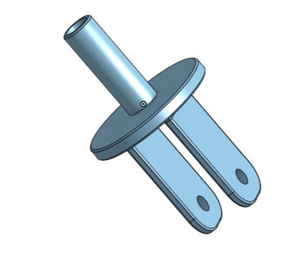
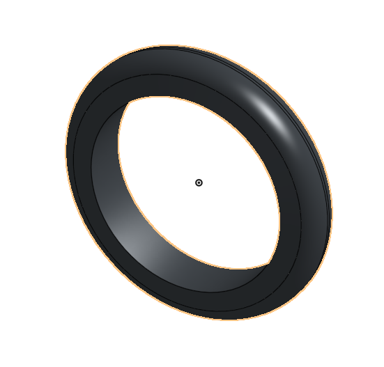
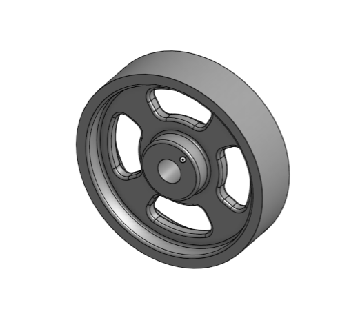
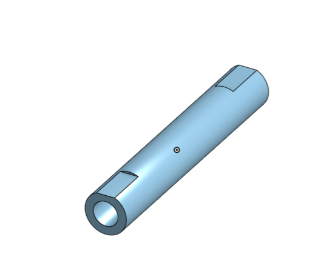
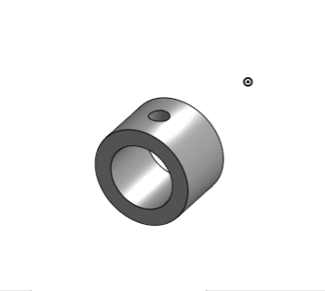

# BasicCAD

## Caster Assignment

---
##  Caster Table of Contents
* [Table of Contents](#Table-of-Contents)
* [Base](#Base)
* [Mount](#Mount)
* [Fork](#Fork)
* [Tire](#Tire)
* [Wheel](#Wheel)
* [AxleCollarBearings](#AxleCollarBearings)

## Base

### Description

The assignment was to make a base for the caster by creating and extruding a 200 by 120 mm rectangle with six linear patterned holes each 10 mm in diameter and with a large hole of diameter of 25 mm to the center left. 

### Evidence
[The Base in Onshape](https://cvilleschools.onshape.com/documents/39f4d60dddb5d6332b393c30/w/b41c95f4b285467259fc4dd6/e/d9988f9271af2bb6982c088e)

### Image

### Reflection

Lessons Learned: 
- Using keyboard shortcuts "N" for normal and "P" to hide planes 
- Faulty/unwanted dimensions can be deleted simply by selecting them and pressing the "backspace" key
- Using a mouse makes orientation and zoom controls much easier
 Dimensioning the end of the rectangle 60 mm from the origin made sketching the fork hole easy. As long as it was coincident to the origin, it already had a position on the part. 

---

## Mount

### Description

The task was to create a mount for the caster by sketching and extruding a 120 by 120 mm rectangle with four linear patterned holes of 10 mm diameter in the corners and a center hole of 25 mm. 

### Evidence

[The Mount in Onshape](https://cvilleschools.onshape.com/documents/39f4d60dddb5d6332b393c30/w/b41c95f4b285467259fc4dd6/e/f32a9f0dfa47ef02a3fc1dc2)

### Image

### Reflection

Lessons Learned: 
- Again, centering sketch features on the orgin makes positioning much easier. 
- Remembering to click arrows to switch the direction of the extrude, if needed. 
- A liner pattern can be done in two directions in one use. 
- If pattern features don't appear when creating a linear pattern, make sure the direction arrows are correct. 
- It would have been much faster to simply edit the base part and remove the extra 80 mm and the last two holes. 

---

## Fork

### Description

The fork part is meant to connect the wheel of the caster to the mount and base. It consists of a column that goes through the base and center hole of the mount at the top, and a branched end that connects to the axle on either side of the wheel. The axle and fork are joined together with collars, which are then secured with pins. 

### Evidence

[The Fork in Onshape](https://cvilleschools.onshape.com/documents/39f4d60dddb5d6332b393c30/w/b41c95f4b285467259fc4dd6/e/2cc36e70205b8ae4474d659a)

### Image

### Reflection

Lessons Learned: 

- Unlike in SolidWorks, licking just one edge of a feature face will allow for a fillet of every edge of the surface. 
- Remembering to select tangential propegation in fillet options if a skirt around the base of a feature is required. 
- When mirroring, make sure to select every element of a feature, including its fillets and any other alterations, not just the feature itself.

---

## Tire

### Description

The tire is a rounded part meant to attach to the wheel of the caster. It has a diameter of 80 mm. 

### Evidence

[The Tire in Onshape](https://cvilleschools.onshape.com/documents/39f4d60dddb5d6332b393c30/w/b41c95f4b285467259fc4dd6/e/851add4bbef13df560973810)

### Image

### Reflection

Lessons Learned:

- It is important to note exactly which two sketch aspects are being dimensioned together in the instructions.
- Angle dimensions can be created if slanted lines are used. 
- Clicking a line, the center line, and the below the center line will create a diameter, which is useful for revolves. 
- Fillets can be used to make a part rounded, not simply to soften edges.

---

## Wheel

### Description

The goal was to create a wheel part for the caster that would be able to connect to the axle and would fit inside the tire, complete with cutout spokes. 

### Evidence

[The Wheel in Onshape](https://cvilleschools.onshape.com/documents/39f4d60dddb5d6332b393c30/w/b41c95f4b285467259fc4dd6/e/851add4bbef13df560973810)

### Image

### Reflection

Lessons Learned: 
- How to create two parts in a single part studio by selecting "Add" when extruding. 
- If a feature is created on the wrong plane originally, reentering the sketch and changing the plane will not affect the sketch geometry and will rebuild the feature on the selected, correct plane. 
- Making lines coincident with the origin, in sketches such as this, will simply line them up and fully constrain the sketch. 
- Draw the lines and shapes of sketches in as close a manner as possible to how the sketch should look one dimensioned, this will make everything simpler. 
- Also, dimension sketches in a logical order so that newly added dimensions do not cause them to become temporarily twisted or misshapen. 

---

## Axle, Collar, & Bearings

### Description

This assignment involved creating an axle that would attach the wheel and fork, a collar that would attach the fork and axle, and large and small bearimgs that would space the sides of the wheel and fork, and the mount and face of the fork, respectively. 

### Evidence

[The Axle and Collar in OnShape](https://cvilleschools.onshape.com/documents/39f4d60dddb5d6332b393c30/w/b41c95f4b285467259fc4dd6/e/287f4646c8d08ae3f2a4b422)

[The Big Bearing in OnShape](https://cvilleschools.onshape.com/documents/39f4d60dddb5d6332b393c30/w/b41c95f4b285467259fc4dd6/e/6d9c377fdd24396f48414e6c)

[The Wheel Bearing in OnShape](https://cvilleschools.onshape.com/documents/39f4d60dddb5d6332b393c30/w/b41c95f4b285467259fc4dd6/e/851add4bbef13df560973810)

### Image

  - The axle, independently

- The collar, independently

- Axle and collar together

- Big bearing, independently

- Big Bearing With Wheel & Tire

### Reflection

Lessons Learned:

- Clicking "Use" allows you to add sketch entities from a different feature into a current sketch, which is very useful for both extrusion/creation and dimensioning. 
- Originally, when I assembled the caster, the two large bearings on either side of the wheel were too large, and intercepted the fork. To quickly fix this I went back and cut their extrude depth in half, from 5 mm to 2.5 mm, which luckily allowed them to line up perfectly with the sides of the fork and the sides of the wheel. 
- Switching the extrude direction of the hole in the collar so it was near the side of the axle with the flat made it easier to line these features up parallely when it came time to assemble. 

---

[Link to final caster assembly in OnShape](https://cvilleschools.onshape.com/documents/39f4d60dddb5d6332b393c30/w/b41c95f4b285467259fc4dd6/e/d439bace84c2e1d9f3ead496)
